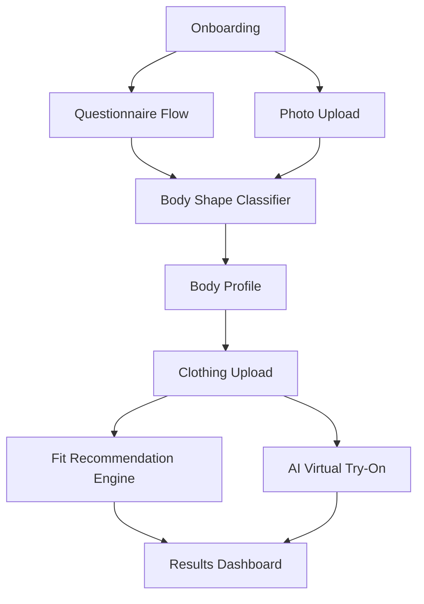

# BodyFit — iOS Body Shape & Virtual Try-On MVP

An iOS app that identifies your body shape through a questionnaire + photo analysis, then shows how clothes will look on you and provides fit recommendations.

## Architecture Overview



**Tech Stack:**
- **Language**: Swift 5.9+ / SwiftUI
- **Architecture**: MVVM
- **On-device AI**: Apple Vision framework (body pose detection, segmentation — **free**)
- **Cloud AI**: Hugging Face Inference API (virtual try-on — **free tier**)
- **Storage**: Local (UserDefaults + FileManager for MVP)

---

## User Review Required

> [!IMPORTANT]
> **Hugging Face Free Tier Limitations**: The free inference API has rate limits (~30 requests/hr). For MVP demo purposes this is sufficient, but production use would need a paid plan or self-hosted model.

> [!NOTE]
> **Virtual Try-On Quality**: Truly realistic AI try-on (like Google's virtual try-on) requires enterprise-grade models. For MVP, we'll use the best available open-source model on Hugging Face (IDM-VTON or similar). Results will be decent but not production-perfect.

> [!IMPORTANT]
> **Xcode Required**: This is a native iOS app. You'll need Xcode installed to build and run it. The app will be tested on the iOS Simulator.

---

## Proposed Changes

### Project Structure

```
BodyFitApp/
├── BodyFitApp.swift                 # App entry point
├── ContentView.swift                # Main navigation
├── Info.plist                       # Permissions
├── Assets.xcassets/                 # Colors & images
│
├── Models/
│   ├── BodyProfile.swift            # User body data model
│   ├── BodyShape.swift              # Shape enum & classification
│   ├── Clothing.swift               # Clothing item model
│   └── FitRecommendation.swift      # Recommendation model
│
├── ViewModels/
│   ├── OnboardingViewModel.swift    # Questionnaire logic
│   ├── BodyAnalysisViewModel.swift  # Photo analysis + classification
│   ├── ClothingViewModel.swift      # Clothing management
│   └── TryOnViewModel.swift         # AI try-on orchestration
│
├── Views/
│   ├── Onboarding/
│   │   ├── WelcomeView.swift        # Landing screen
│   │   ├── QuestionnaireView.swift  # Step-by-step questions
│   │   └── PhotoCaptureView.swift   # Body photo upload
│   │
│   ├── Profile/
│   │   ├── BodyProfileView.swift    # Shape results & profile
│   │   └── BodyShapeDetailView.swift# Shape info & tips
│   │
│   ├── Clothing/
│   │   ├── ClothingUploadView.swift # Upload clothing photos
│   │   └── ClothingGalleryView.swift# Saved clothing items
│   │
│   ├── TryOn/
│   │   ├── TryOnView.swift          # Virtual try-on screen
│   │   └── FitResultView.swift      # Recommendations display
│   │
│   └── Components/
│       ├── ShapeVisualizer.swift     # Body shape illustration
│       ├── MeasurementInput.swift   # Measurement input component
│       └── AnimatedCard.swift       # Reusable card component
│
├── Services/
│   ├── VisionAnalyzer.swift         # Apple Vision body analysis
│   ├── ShapeClassifier.swift        # Body shape algorithm
│   ├── FitEngine.swift              # Fit recommendation logic
│   └── HuggingFaceAPI.swift         # AI try-on API client
│
└── Utilities/
    ├── ImagePicker.swift            # Photo library/camera picker
    ├── Extensions.swift             # Swift extensions
    └── Constants.swift              # App constants & colors
```

---

### Models Layer

#### [NEW] [BodyProfile.swift](file:///Users/shwetakadam/.gemini/antigravity/scratch/BodyFitApp/BodyFitApp/Models/BodyProfile.swift)
- Stores user measurements: bust, waist, hips, height, weight, shoulder width
- Stores questionnaire answers (body concerns, problem areas like stomach bulge)
- Codable for local persistence

#### [NEW] [BodyShape.swift](file:///Users/shwetakadam/.gemini/antigravity/scratch/BodyFitApp/BodyFitApp/Models/BodyShape.swift)
- Enum: `hourglass`, `pear`, `apple`, `rectangle`, `invertedTriangle`
- Each case has description, characteristics, and styling tips
- Confidence score from classification

#### [NEW] [Clothing.swift](file:///Users/shwetakadam/.gemini/antigravity/scratch/BodyFitApp/BodyFitApp/Models/Clothing.swift)
- Clothing item with image, category (top, bottom, dress), size

#### [NEW] [FitRecommendation.swift](file:///Users/shwetakadam/.gemini/antigravity/scratch/BodyFitApp/BodyFitApp/Models/FitRecommendation.swift)
- Fit score (1-10), fit issues (tight areas, loose areas), suggestions

---

### Services Layer

#### [NEW] [VisionAnalyzer.swift](file:///Users/shwetakadam/.gemini/antigravity/scratch/BodyFitApp/BodyFitApp/Services/VisionAnalyzer.swift)
- Uses `VNDetectHumanBodyPoseRequest` for body landmark detection
- Extracts proportions: shoulder width, torso length, hip width from pose keypoints
- Uses `VNGeneratePersonSegmentationRequest` to isolate body silhouette
- Calculates body ratios to refine shape classification

#### [NEW] [ShapeClassifier.swift](file:///Users/shwetakadam/.gemini/antigravity/scratch/BodyFitApp/BodyFitApp/Services/ShapeClassifier.swift)
- **Algorithm**: Combines questionnaire measurements + Vision analysis
- Ratio-based classification:
  - **Hourglass**: bust ≈ hips, waist significantly smaller
  - **Pear**: hips > bust, defined waist
  - **Apple**: waist ≈ bust > hips, weight around middle
  - **Rectangle**: bust ≈ waist ≈ hips, uniform
  - **Inverted Triangle**: bust/shoulders > hips
- Weighted scoring with confidence level

#### [NEW] [FitEngine.swift](file:///Users/shwetakadam/.gemini/antigravity/scratch/BodyFitApp/BodyFitApp/Services/FitEngine.swift)
- Cross-references body profile with clothing category
- Generates specific fit predictions (e.g., "May be snug around midsection")
- Provides styling tips based on body shape + clothing type
- Highlights areas of concern the user specified (stomach bulge, etc.)

#### [NEW] [HuggingFaceAPI.swift](file:///Users/shwetakadam/.gemini/antigravity/scratch/BodyFitApp/BodyFitApp/Services/HuggingFaceAPI.swift)
- Connects to Hugging Face free inference API
- Uses open-source virtual try-on model (e.g., `yisol/IDM-VTON` or similar)
- Sends body photo + clothing photo → receives try-on result
- Handles rate limiting and error states gracefully
- **Note**: User will need to set their free Hugging Face API token

---

### Views Layer

#### [NEW] [WelcomeView.swift](file:///Users/shwetakadam/.gemini/antigravity/scratch/BodyFitApp/BodyFitApp/Views/Onboarding/WelcomeView.swift)
- Premium animated welcome screen with app branding
- "Get Started" CTA with smooth transition

#### [NEW] [QuestionnaireView.swift](file:///Users/shwetakadam/.gemini/antigravity/scratch/BodyFitApp/BodyFitApp/Views/Onboarding/QuestionnaireView.swift)
- Multi-step paginated questionnaire:
  1. **Basic info**: Height, weight, age
  2. **Measurements**: Bust, waist, hip circumference (with visual guide)
  3. **Body concerns**: Stomach bulge, broad shoulders, narrow hips, etc. (multi-select)
  4. **Fit preferences**: Loose, fitted, or balanced
  5. **Problem areas**: Where clothes typically don't fit well
- Progress bar, animated transitions between steps

#### [NEW] [PhotoCaptureView.swift](file:///Users/shwetakadam/.gemini/antigravity/scratch/BodyFitApp/BodyFitApp/Views/Onboarding/PhotoCaptureView.swift)
- Camera/photo library picker for full-body photo
- Guide overlay showing ideal pose position
- Option to skip (questionnaire alone is sufficient)

#### [NEW] [BodyProfileView.swift](file:///Users/shwetakadam/.gemini/antigravity/scratch/BodyFitApp/BodyFitApp/Views/Profile/BodyProfileView.swift)
- Displays classified body shape with animated illustration
- Shows measurements and proportions
- Styling tips for the detected shape

#### [NEW] [TryOnView.swift](file:///Users/shwetakadam/.gemini/antigravity/scratch/BodyFitApp/BodyFitApp/Views/TryOn/TryOnView.swift)
- Upload clothing photo
- Shows AI-generated try-on result
- Displays fit recommendations alongside

---

### UI Design

- **Dark mode first** with rich gradients (deep purple → indigo → teal)
- **Glassmorphism** cards with blur effects
- **SF Symbols** for icons
- **Custom animations** using SwiftUI transitions
- **Premium typography** using system fonts with custom weights
- **Haptic feedback** on interactions

---

## Verification Plan

### Automated Tests
1. **Build verification**: `xcodebuild -scheme BodyFitApp -destination 'platform=iOS Simulator,name=iPhone 16' build` — confirms project compiles without errors
2. **Shape classification unit logic**: Verify the ratio-based classification returns correct shapes for known measurement sets (tested within Xcode)

### Simulator Verification
1. Build and launch on iOS Simulator
2. Walk through the complete flow:
   - Welcome → Questionnaire → Photo (skip) → Body Shape Result → Upload Clothing → View Recommendations
3. Verify UI renders correctly on iPhone 16 simulator

### Manual Verification (User)
1. **Install on device** via Xcode → test with real photos
2. **Enter real measurements** and verify body shape classification feels accurate
3. **Test virtual try-on** with a clothing photo (requires setting Hugging Face API token)
4. **Review fit recommendations** for accuracy and helpfulness
